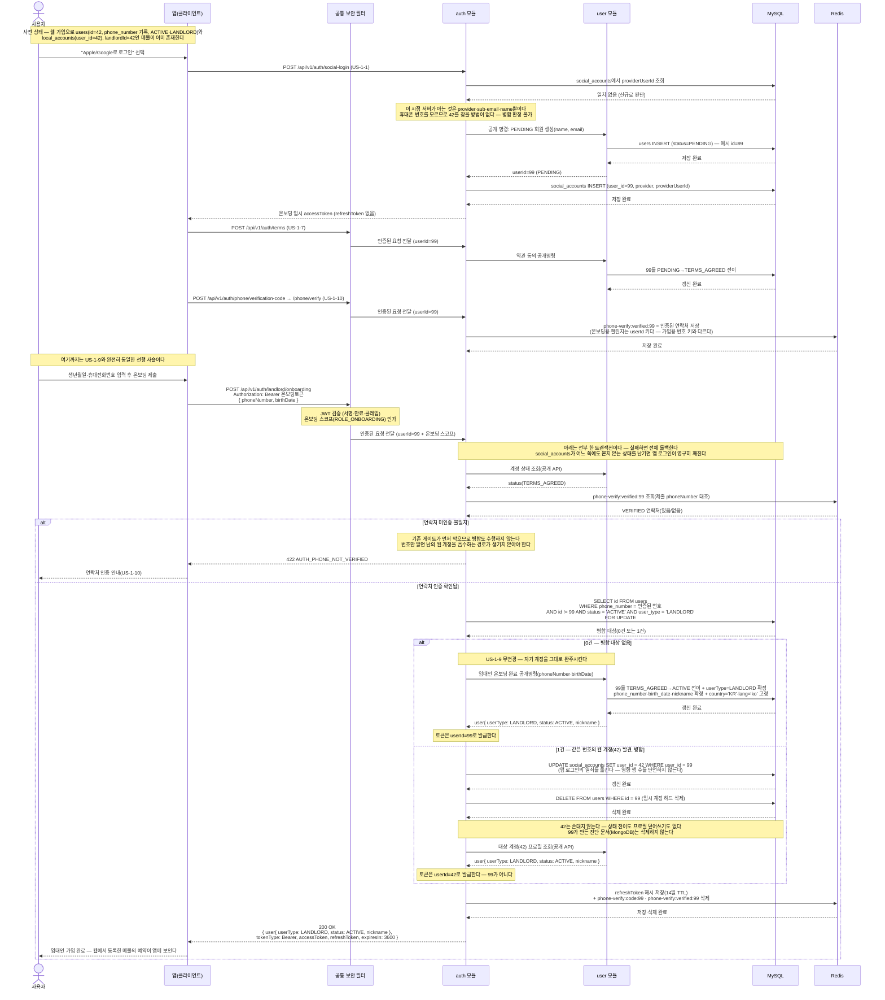

# US-1-15 — 앱 임대인 온보딩 시 기존 웹 계정과 병합하기

> 모듈: 소셜 로그인 · 온보딩 · [유저 스토리](../../../requirements/user-stories.md) · [API 스펙](../../../api/specs/01-auth-onboarding.md)
>
> 웹에서 먼저 가입해 매물을 등록해 둔 임대인([US-1-11](us-1-11-web-signup.md))이 앱에서 소셜 로그인해 임대인 온보딩([US-1-9](us-1-9-landlord-onboarding.md))을 마칠 때, 같은 번호의 웹 계정과 **하나로 합치는** 흐름이다. 엔드포인트는 신설하지 않고 기존 `POST /api/v1/auth/landlord/onboarding`에 **병합 분기를 추가**한다.
>
> **판정 지점이 로그인이 아니라 온보딩인 이유**: 소셜 로그인은 `name`·`email`만 주고 휴대폰 번호를 주지 않는다. 서버가 번호를 처음 아는 시점은 **연락처 SMS 인증([US-1-10](us-1-10-phone-verification.md))을 통과한 온보딩 제출**이며, 그때는 이미 소셜 로그인이 `createPendingUser`로 임시 `users` 행을 만들어 둔 뒤다. 그래서 웹→앱 방향(US-1-11)이 **연결**인 것과 달리 앱→웹 방향은 **병합**이 된다. 병합이 안전한 이유는 그 임시 계정이 방금 만들어져 **매물·예약·채팅이 하나도 없기 때문**이고, 실제로 옮길 것은 `social_accounts` 행 하나뿐이다.
>
> 아래 `42`(웹 계정)·`99`(임시 계정)는 설명용 예시 id다.

## 흐름 요약

- **선행 사슬은 US-1-9와 동일하다.** 소셜 로그인(US-1-1)이 `social_accounts` 조회에서 일치를 찾지 못해 임시 `users` 행(`PENDING`, 예시 id=99)과 `social_accounts` 행을 만들고 온보딩 토큰을 내린다. 이 시점에는 번호를 모르므로 **병합 판정 자체가 불가능**하다. 이어 약관 동의(US-1-7)로 `TERMS_AGREED`가 되고, 연락처 SMS 인증(US-1-10)이 **`userId` 키** 챌린지(`phone-verify:verified:{userId}`)로 검증 마커를 남긴다 — 가입용 인증([US-1-13](us-1-13-signup-phone-verification.md))이 쓰는 번호 키 챌린지와는 다른 키 공간이다.
- **인증 게이트가 병합보다 먼저다.** 온보딩 제출에서 기존 게이트(약관 → 연락처 인증)를 그대로 통과해야 하며, 마커가 없거나 제출 번호와 다르면 `422 AUTH_PHONE_NOT_VERIFIED`로 끊고 **병합도 수행하지 않는다**. 이 순서가 유지되어야 "번호만 알면 남의 웹 계정을 흡수한다"는 경로가 생기지 않는다.
- **병합 대상 조회는 `SELECT ... FOR UPDATE`로 잠근다.** 조건은 **인증된 번호 + 자기 자신 제외(`id != currentUserId`) + `status='ACTIVE'` + `user_type='LANDLORD'`** 다. 뒤 두 조건은 지금은 중복이다 — 번호는 임대인 온보딩(= `ACTIVE` 전이) 시점에만 기록되고, 웹 가입은 한 트랜잭션으로 `ACTIVE`까지 완주하며, 세입자·탈퇴자는 NULL이라 **`phone_number`가 채워진 계정은 사실상 `ACTIVE` 임대인뿐**이기 때문이다. 그럼에도 명시하는 이유는 나중에 누군가 다른 경로에서 `PENDING` 계정에 번호를 채워도 병합이 오작동하지 않게 하기 위해서다 — **암묵 불변식에 기대지 않는다.** 잠금은 두 기기가 동시에 같은 계정으로 병합하는 경우를 직렬화한다.
- **0건이면 US-1-9가 그대로 동작한다.** 자기 계정을 `TERMS_AGREED`→`ACTIVE`로 전이시키고 `userType=LANDLORD`를 확정한 뒤 자기 `userId`로 토큰을 발급한다 — 기존 임대인 온보딩 동작은 **한 줄도 바뀌지 않는다**.
- **1건이면 세 가지만 한다.** ① `UPDATE social_accounts SET user_id = 42 WHERE user_id = 99`로 **앱 로그인의 열쇠를 옮기고**, ② `DELETE FROM users WHERE id = 99`로 임시 행을 **하드 삭제**하며, ③ **대상 id(42)로** 토큰을 발급한다. 대상 계정은 이미 `ACTIVE`·`LANDLORD`이므로 상태 전이가 없고, 프로필도 덮어쓰지 않는다. 응답의 `user` 프로필 역시 42 기준이다. UPDATE의 영향 행 수는 **단언하지 않는다** — 임시 계정은 실제로 `social_accounts`가 1행이지만 코드가 그것을 가정할 이유가 없고, UPDATE는 N행이어도 안전하다.
- **대상 쪽에 `social_accounts`가 여러 행이 되는 것은 정상이다.** 같은 사람이 Google로 병합한 뒤 Apple로도 앱 로그인해 다시 병합하면 42에 2행이 붙는다. `(provider, provider_user_id)` UNIQUE는 값이 달라 위반되지 않으며, **한 사람이 여러 소셜 계정으로 같은 계정에 들어오는 것**이라 막을 근거가 없다.
- **병합 후 앱 로그인은 항상 대상 계정으로 귀결된다.** `social_accounts`의 `providerUserId` 조회가 `user_id=42`를 반환하므로, 앱의 임대인 예약 조회(`GET /api/v1/bookings`, `WHERE landlord_id = 42`)에 **웹에서 등록한 매물의 신청이 그대로 보인다**. 이것이 공유 `user_id` 설계를 택한 이유이며, 두 방향(연결·병합) 모두 **매물·예약 데이터는 한 건도 옮기지 않는다** — id가 하나라 옮길 필요가 없다.
- **원자성이 필수다.** 위 전부가 한 트랜잭션이며, 도중에 실패하면 전체를 롤백한다. `social_accounts`가 어느 쪽에도 붙지 않는 상태가 되면 그 사용자의 앱 로그인이 영구히 깨진다.
- **동시성의 최종 방어선은 `users.phone_number` UNIQUE 제약이다.** 같은 번호로 웹 가입(US-1-11)과 앱 온보딩이 거의 동시에 도착하면 양쪽 다 "기존 계정 없음"으로 판정해 `ACTIVE` 계정이 둘 생길 수 있다(check-then-act). 애플리케이션 조회로는 막을 수 없고, **DB 제약이 늦은 쪽을 실패시키는 것이 유일한 수단**이다 — 실패한 쪽은 재시도하면 상대가 만든 계정을 발견해 정상 연동·병합된다. 세입자·탈퇴자는 번호가 NULL이고 MySQL UNIQUE는 NULL 중복을 허용하므로 영향받지 않는다.

## 병합 분기 정리

| 판정 | 조건 | 결과 |
| --- | --- | --- |
| 게이트 미통과 | 약관 미동의(`PENDING`) | `422 AUTH_TERMS_AGREEMENT_REQUIRED`(기존) — 병합 없음 |
| 게이트 미통과 | 인증 마커 없음·제출 번호 불일치 | `422 AUTH_PHONE_NOT_VERIFIED`(기존) — **병합 없음** |
| 이미 완료 | 자기 계정이 이미 `ACTIVE` | `409 AUTH_ONBOARDING_ALREADY_COMPLETED`(기존) |
| **병합 없음** | 같은 번호의 다른 `ACTIVE`·`LANDLORD` 계정 0건 | US-1-9 그대로 — 자기 계정 `ACTIVE` 전이, 자기 id로 토큰 |
| **병합** | 같은 번호의 다른 `ACTIVE`·`LANDLORD` 계정 1건 | `social_accounts.user_id` 이전 + 임시 `users` 행 DELETE + **대상 id로 토큰** |

## 알려진 제약

- **임시 계정의 진단 기록은 삭제하지 않는다.** 병합은 `users` 행만 지운다. `/api/v2/diagnoses`가 permitAll이라 온보딩 스코프 토큰으로도 진단 문서가 생성될 수 있어, **사라진 계정을 가리키는 진단 문서가 MongoDB에 남을 수 있다.** 그럼에도 지우지 않는 이유는 대칭성이다 — 현재는 **회원 탈퇴조차 진단을 지우지 않으며**(`UserWithdrawnEvent` 구독자는 auth 하나뿐이다), 병합이 탈퇴보다 공격적으로 지우는 비대칭을 만들지 않는다. 그 문서를 조회할 주체가 없어 실질 영향도 없다.
- **번호 정규화 백필이 없다.** 병합 조회는 정규화된(숫자만 남은) 번호로 대조하므로, `users.phone_number`에 하이픈을 포함해 저장된 기존 임대인 행은 **매칭에서 누락돼 병합되지 않을 수 있다.**
- **앱·웹 양쪽에 같은 번호의 완주 계정이 각각 있으면 자동 병합하지 않는다.** 양쪽 모두 매물·예약을 보유했을 수 있어 데이터 이관 판단이 필요하고, 온보딩 경로를 다시 타지 않으므로 트리거도 없다 — 운영 수동 처리 대상이다. 코드도 화면도 만들지 않는다.
- **매물 이미지 pending 업로드 키는 id를 품는다.** 임시 업로드 경로가 `uploads/{landlordId}/...` 형태라, 병합으로 id가 바뀌면 진행 중이던 pending 업로드가 고아가 된다. 병합은 앱 소셜 로그인 직후에만 일어나 그 시점에 진행 중인 업로드가 없으므로 실무상 무해하다.
- **`chat`은 아직 영속 계층이 없어 병합 대상이 아니다.** 채팅 저장소가 붙으면 소유 축이 `user_id`인지 재확인해야 한다(현재 설계대로면 id를 공유하므로 추가 처리가 필요 없다).
