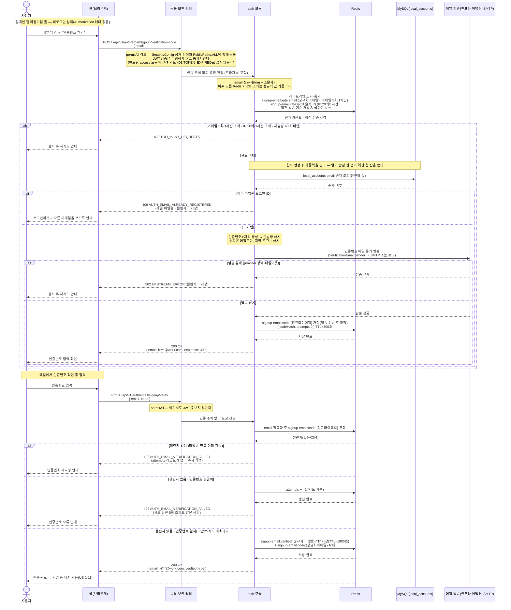

# US-1-18 — 가입용 이메일 인증하기 (비로그인 · 임대인 웹)

> 모듈: 소셜 로그인 · 온보딩 · [유저 스토리](../../../requirements/user-stories.md) · [API 스펙](../../../api/specs/01-auth-onboarding.md)
>
> 임대인 웹 회원가입(US-1-11) 제출 **전에** 수행하는 이메일 소유 인증이다. 정식 사용자용 이메일 인증([US-1-6](us-1-6-email-verification.md))과 **정책(6자리·코드 TTL 5분·검증 마커 30분·시도 5회·재발송 60초)과 발송 포트(`VerificationEmailSender`)를 그대로 공유**하지만, 아직 계정이 없어 `userId`가 존재하지 않는 단계라 **챌린지 키가 다르다** — US-1-6은 `email-verify:*:{userId}`, 이 경로는 **정규화한 이메일을 키로 쓰는** `signup-email:*:{정규화이메일}`이다. 키가 다르므로 엔드포인트도 재사용하지 않고 신설하며, 비로그인이라 **permitAll**로 연다.
>
> 가입용 연락처 인증([US-1-13](us-1-13-signup-phone-verification.md))과 **한 가지에서 정반대로 간다** — 이쪽은 **이미 가입된 주소면 발송 전에 `409`로 끊는다.** 감추면 남의 메일함으로 인증번호가 실제로 날아가고(이메일 채널은 그 발송 자체가 피해다), 사용자는 가입 제출까지 가서야 중복을 안다. 대가로 **가입 여부 열거를 수용**한다.

## 흐름 요약

- **비로그인 진입점이다.** 두 엔드포인트(`POST /api/v1/auth/email/signup/verification-code` · `POST /api/v1/auth/email/signup/verify`) 모두 토큰 없이 호출되므로 **`SecurityConfig`의 공개(permitAll) 티어와 [`PublicPaths.ALL`](../../../../src/main/java/com/kohere/common/security/PublicPaths.java) 두 곳에 함께 등록**한다. 기존 `/auth/email/verification-code`·`/auth/email/verify`는 `hasRole("USER")` 정확 경로 매처라 한 세그먼트 깊은 이 경로를 덮지 않지만, **명시하지 않으면 `anyRequest().authenticated()`로 떨어져 `401`** 이다. 공개 티어라 필터가 주체(`userId`)를 세우지 않으며, 그래서 챌린지 키를 이메일로 잡는다.
- **키는 정규화한 이메일이다.** `auth`가 입력 `email`의 앞뒤 공백을 지우고 소문자로 접은 값을 Redis 키로 쓰고(`signup-email:code:{정규화이메일}`), 검증에 성공하면 마커 `signup-email:verified:{정규화이메일}`에 `"1"`을 **TTL 1800초**로 기록한다. 이 마커는 **가입 제출(US-1-11)에서만 소비**하므로 용도 구분 필드가 없다 — **키스페이스가 곧 용도**이며, US-1-13의 `signup-phone:*`와 나눈 것도 같은 이유다(마커 하나가 다른 흐름의 게이트를 통과시키면 인가 범위가 조용히 넓어진다).
- **판정 순서가 계약이다 — 쿨다운 → 한도 → 중복 → 발송 → 저장.** 쿨다운을 한도보다 먼저 보는 것은 버튼 두 번 누르기로 시간당 한도를 깎지 않기 위해서고, **중복 검사를 한도 뒤에 두는 것은 열거 관찰 한 번이 예산 한 칸을 쓰게 하기 위해서다.** 순서를 뒤집으면 카운터를 하나도 올리지 않고 무한히 물어볼 수 있고, 그 판정은 익명 호출자가 유발하는 **DB 읽기**다.
- **레이트리밋 예산을 다른 채널과 나눈다.** 가입용 SMS(US-1-13)·이메일 찾기(US-1-16)·재설정 링크(US-1-17)와 각각 다른 버킷을 쓴다. 공유하면 사용자가 화면을 오가는 것만으로 서로의 몫을 태워 두세 번 만에 `429`가 난다.
- **발송 실패 시 챌린지를 저장하지 않는다.** 동기 발송이므로 provider 장애·타임아웃이면 Redis에 아무것도 쓰지 않고 `502 UPSTREAM_ERROR`를 반환한다(US-1-6과 동일). 저장부터 하면 메일을 못 받은 사용자가 만료를 기다려야 하고 재발송 쿨다운만 소모된다.
- **확인 실패는 응답을 하나로 통일한다.** 챌린지 없음(미발송·만료·이미 검증)·인증번호 불일치·시도 상한 초과가 **모두 `422 AUTH_EMAIL_VERIFICATION_FAILED`** 다. 정식 사용자용 US-1-6이 시도 상한 초과에 `429 TOO_MANY_REQUESTS`를 쓰는 것과 다른데, 비로그인 경로는 응답 차이 자체가 **챌린지 존재 여부와 시도 잔량을 알려주는 신호**가 되므로 구분하지 않는다.
- **가입 제출과의 접점은 마커 하나다.** US-1-11은 연락처 마커와 이메일 마커를 **둘 다** 확인하고(서로 순서 무관), 성공하면 **커밋 이후에** 두 마커를 함께 소비한다. 트랜잭션 안에서 지우면 커밋 시점 실패가 MySQL만 되돌리고 마커는 사라져 사용자가 인증 두 개를 다시 해야 한다.
- 인증번호 원문은 저장·로그하지 않고 해시만 보관하며, `email`은 응답·로그에서 마스킹(`ki***@work.com`)한다([error-response-guide §6](../../../api/error-response-guide.md)).

## 실패 응답 정리

| 경우 | 응답 | 부수효과 |
| --- | --- | --- |
| 이메일·IP 한도 초과, 재발송 60초 미만 | `429 TOO_MANY_REQUESTS` | 없음(메일 미발송, 챌린지 미변경) |
| 이미 가입된 로그인 ID | `409 AUTH_EMAIL_ALREADY_REGISTERED` | **없음 — 메일을 보내지 않고 챌린지도 만들지 않는다** |
| 메일 발송 실패(provider 장애·타임아웃) | `502 UPSTREAM_ERROR` | **없음 — 챌린지를 저장하지 않는다** |
| 챌린지 없음(미발송·만료·이미 검증) | `422 AUTH_EMAIL_VERIFICATION_FAILED` | 없음(올릴 `attempts` 레코드가 없다) |
| 인증번호 불일치 | `422 AUTH_EMAIL_VERIFICATION_FAILED` | `attempts += 1` |
| 시도 상한(5회) 초과 | `422 AUTH_EMAIL_VERIFICATION_FAILED` | 없음 — **US-1-6과 달리 429로 구분하지 않는다** |
| 형식 위반(`email` 누락·형식 아님·255자 초과) | `400 INVALID_INPUT` | 없음(Bean Validation 단계에서 차단) |

## 알려진 제약

- **가입 여부 열거가 가능하다.** 발송 응답이 `409`인지 `200`인지로 임의의 주소가 웹 로그인 ID로 쓰이는지 알 수 있다. 선행 게이트가 없는 경로라 막을 수단이 없으며, 레이트리밋은 비용 상한이지 방어가 아니다(이메일 축은 한 주소당 한 번만 물으면 되는 관찰에 무력하고, 실제로 묶는 IP 축은 `X-Forwarded-For`라 위조 가능하다). **그 결과 US-1-17의 재설정 링크 발송이 `200`으로 감추려던 사실이 이 경로로 드러나** 그쪽 방어는 깊이 방어로 남는다. 명시적으로 수용한 결과다.
- **가입 제출까지의 30분 창에서 중복이 갈릴 수 있다.** 발송 시점에 미가입이던 주소를 그사이 남이 가입해 버리면 제출에서 `409 AUTH_EMAIL_ALREADY_REGISTERED`가 난다. 유일성을 보장하는 것은 응답이 아니라 `uq_local_accounts_email`이므로 **US-1-11의 중복 게이트는 이 인증이 생긴 뒤에도 남는다**.
- **앱스토어 심사용 고정 인증번호 우회(`FixedVerificationPolicy`)는 이 경로에 적용되지 않는다.** 그 우회는 `userId` + Google 소셜 계정을 기준으로 판정하는데, 가입 전 경로에는 둘 다 없다. 따라서 발급 포트를 US-1-6과 **공유하지 않고 따로 둔다** — 공유하면 dev·local에서 우회 래퍼가 주입돼 존재하지 않는 `userId`로 심사 계정을 판정하게 된다.
- **인증 절차에는 환경별 토글이 없다.** 모든 실행 환경에서 같은 흐름이 돌며, 설정으로 가르는 것은 **메일을 실제 발송할지 인증번호를 로그로 남길지**(발송 채널)뿐이다. 기능 토글을 두면 꺼진 환경에서 마커를 만들 방법이 없어 가입이 막히거나, 게이트까지 꺼서 **인증 없이 가입되는** 둘 중 하나가 된다.
