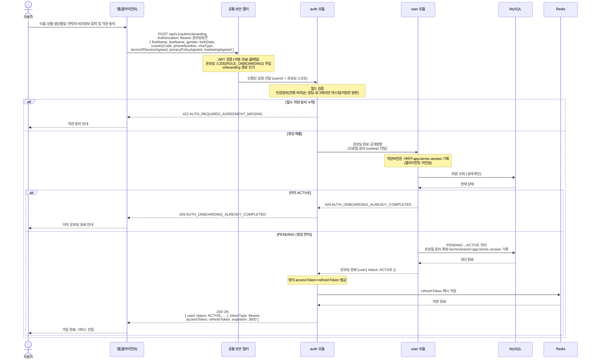

# US-1-2 — 필수 온보딩 정보·약관 동의 제출하기

> 모듈: 소셜 로그인 · 온보딩 · [유저 스토리](../../../requirements/user-stories.md) · [API 스펙](../../../api/specs/01-auth-onboarding.md)

## 흐름 요약

- PENDING 사용자가 온보딩 토큰으로 필수 프로필과 약관 동의(boolean)를 담아 `POST /api/v1/auth/onboarding`을 호출하며, 공통 보안 필터(SEC)가 컨트롤러 앞단에서 JWT를 검증하고 **온보딩 스코프(`ROLE_ONBOARDING`)를 주입·onboarding 경로 인가**를 마친 뒤 `userId + 온보딩 스코프`를 `auth 모듈`로 전달한다.
- `auth 모듈`이 요청을 수신해 필드를 검증하고, **온보딩 완료 공개명령으로 `user 모듈`을 호출**한다. 민감정보(전화·비자)는 **저장은 원문**이며 **응답·로그에서만 마스킹**한다.
- 필수 약관(`termsOfServiceAgreed`/`privacyPolicyAgreed`) 미동의면 `422 AUTH_REQUIRED_AGREEMENT_MISSING`으로 거절한다. 약관 버전은 **클라이언트가 보내지 않고**(동의 boolean만 전송), 온보딩 완료 시 **서버가 `app.terms.version`을 `termsVersion`에 기록**한다.
- 이미 `ACTIVE`인 사용자가 다시 제출하면 `409 AUTH_ONBOARDING_ALREADY_COMPLETED`로 거절한다.
- 정상(PENDING)이면 `user 모듈`이 **MySQL에서 상태를 PENDING→ACTIVE로 전이하며 프로필·동의·`termsVersion`을 확정**하고, `auth 모듈`이 정식 access/refresh 토큰을 발급하여 **Redis에 refreshToken 해시를 저장**한 뒤 `200 OK`(`expiresIn: 3600`)로 완성 프로필과 토큰을 반환한다.
