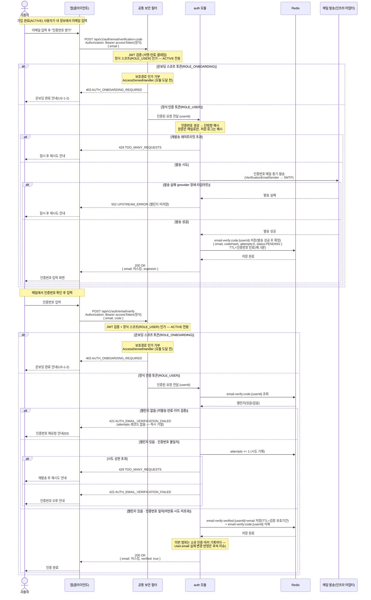

# US-1-6 — 이메일 인증하기 (가입 완료 후)

> 모듈: 소셜 로그인 · 온보딩 · [유저 스토리](../../../requirements/user-stories.md) · [API 스펙](../../../api/specs/01-auth-onboarding.md)
>
> 온보딩 완료(**ACTIVE**) 사용자 전용 이메일 소유 인증이다(#192로 온보딩 단계에서 분리). 정식 토큰(`ROLE_USER`)이 필요하며 **온보딩 토큰으로는 호출할 수 없다**. 인증번호는 `auth`가 해시로만 보관(Redis, TTL)하고 메일 발송은 인프라 어댑터에 위임한다. **이번 범위는 접근을 ACTIVE 전용으로 제한하는 것까지이며, 검증 성공이 `User.email`을 실제로 바꾸지는 않는다(실제 이메일 변경 반영은 후속 이슈).**

## 흐름 요약

- **가입 완료(ACTIVE) 사용자 전용**이다(#192 — 종전 "온보딩 단계 전용, 온보딩 스코프 허용"에서 **ACTIVE 전용으로 반전**). 공통 보안 필터(SEC)가 **정식 토큰(`ROLE_USER`)** 을 검증·인가하며, **온보딩 토큰(`ROLE_ONBOARDING`)으로 접근하면 모듈 도달 전 `AccessDeniedHandler`에서 `403 AUTH_ONBOARDING_REQUIRED`** 로 차단한다(US-1-5와 동일한 tier3 보호경로). 이메일 인증은 온보딩을 마친 뒤에 수행하므로 SEC 단계에서 상태 게이트가 갈리고, `auth` 모듈은 별도 계정 상태 조회 없이 인증번호 발송·확인만 담당한다.
- **인증번호 발송**(`POST /api/v1/auth/email/verification-code`): `auth`가 인증번호를 생성해 **아웃바운드 포트 `VerificationEmailSender`(인프라 어댑터: SMTP)로 동기 발송**하고, **발송에 성공한 뒤에만** 인증번호의 **단방향 해시**를 Redis `email-verify:code:{userId}`에 저장(TTL=만료, 예: 5분 — 확인 필요)한다(원문은 메일로만). provider 장애·타임아웃 등 **발송 실패 시 챌린지를 만들지 않고 `502 UPSTREAM_ERROR`** 로 응답해 재시도를 유도한다. 재발송 레이트리밋 초과는 `429 TOO_MANY_REQUESTS`. 응답의 `email`은 마스킹한다.
- **인증번호 확인**(`POST /api/v1/auth/email/verify`): 챌린지가 **없으면**(미발송·만료·이미 검증) 올릴 `attempts` 레코드가 없으므로 즉시 `422 AUTH_EMAIL_VERIFICATION_FAILED`로 거절하고 인증번호 재요청을 유도한다. 챌린지가 **있고** 입력 인증번호 해시가 `codeHash`와 **불일치**하면 `attempts`를 올려 상한 초과 시 `429 TOO_MANY_REQUESTS`, 아니면 `422`다. **일치**(미만료·시도 미초과)하면 `email-verify:verified:{userId}`에 검증 이메일을 기록하고 코드 키를 제거한다.
- **이번 범위는 접근 제한(ACTIVE 전용)까지**다 — 검증 성공은 소유 인증 마커만 남기고 **`User.email`을 실제로 바꾸지 않는다**. 실제 이메일 변경 반영은 **후속 이슈(#192 범위 밖)**로 미룬다. 온보딩(US-1-2)은 더 이상 이 인증을 선행 게이트로 요구하지 않으며, `AUTH_EMAIL_NOT_VERIFIED`(온보딩 이메일 미인증)는 제거되었다(#192).
- 인증번호 원문은 저장·로그하지 않고(해시만), `email`은 응답·로그 마스킹한다([error-response-guide §6](../../../api/error-response-guide.md)).
