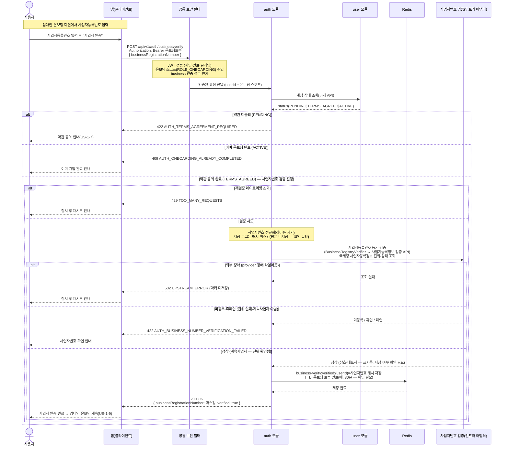

# US-1-8 — 임대인 사업자등록번호 검증하기

> 모듈: 소셜 로그인 · 온보딩 · [유저 스토리](../../../requirements/user-stories.md) · [API 스펙](../../../api/specs/01-auth-onboarding.md)
>
> 임대인 온보딩(US-1-9) 제출 **전에** 수행하는 사업자등록번호 진위·상태 검증이다. 임대인 연락처 인증(US-1-10)과 같은 "별도 검증 → 마커 → 온보딩 대조" 패턴이며, 검증 결과는 `auth`가 Redis에 해시로만 마킹(TTL)하고 외부 조회는 인프라 어댑터에 위임한다. 임대인 전용 경로다.

## 흐름 요약

- 임대인 온보딩 중인 사용자가 입력한 사업자등록번호의 진위·상태를 검증한다. 공통 보안 필터(SEC)가 **온보딩 토큰(`ROLE_ONBOARDING`)** 을 검증하고 `business` 인증 경로를 인가한 뒤 `auth 모듈`로 `userId`를 전달한다(임대인 온보딩 흐름이라 온보딩 토큰을 허용 — [API 스펙](../../../api/specs/01-auth-onboarding.md)). 임대인 연락처 인증(US-1-10)과 **같은** 임대인 전용 검증 단계다.
- **선행 게이트**: 사업자번호 검증은 **약관 동의(US-1-7, `TERMS_AGREED`)가 선행**되어야 한다. `auth`가 `user 모듈` 공개 API로 계정 상태를 조회해 **약관 미동의(`PENDING`)면 `422 AUTH_TERMS_AGREEMENT_REQUIRED`**(약관 동의 안내가 먼저), 이미 완료(`ACTIVE`)면 `409 AUTH_ONBOARDING_ALREADY_COMPLETED`로 거절한다. `TERMS_AGREED`일 때만 아래 검증을 진행한다. 재검증 레이트리밋 초과는 `429 TOO_MANY_REQUESTS`(임계값 미정 — 확인 필요).
- **동기 검증**(`POST /api/v1/auth/business/verify`): `auth`가 사업자번호를 정규화해 **아웃바운드 포트 `BusinessRegistryVerifier`(인프라 어댑터: 사업자등록정보 검증 API — 국세청 사업자등록정보 진위·상태 기반, 구체 provider는 [ADR-0033](../../../adr/0033-business-registry-verification.md))로 동기 검증**한다. **정상(계속사업자, 진위 확인됨)인 경우에만** Redis `business-verify:verified:{userId}`에 **사업자번호 해시**를 마킹(TTL=온보딩 토큰 만료, 예: 30분 — 확인 필요)한다. **미등록·휴폐업·진위 실패**면 마커를 만들지 않고 `422 AUTH_BUSINESS_NUMBER_VERIFICATION_FAILED`로 거절하며, provider 장애·타임아웃 등 **외부 장애 시 `502 UPSTREAM_ERROR`**(기존 공통 코드 재사용)로 응답해 재시도를 유도한다.
- 사업자등록번호 **원문은 저장·로그하지 않고**(해시만 — 확인 필요), 응답·로그에서 마스킹한다([error-response-guide §6](../../../api/error-response-guide.md)). 검증 서비스 회신 상호·대표자는 검증 응답 표시용으로만 쓰며 저장 여부는 확인이 필요하다. 외부 연동 정책 골격은 ADR-0033(Proposed — 확인 필요).
- 이후 **임대인 온보딩 제출(US-1-9)** 에서 `auth`가 제출 사업자번호 해시를 `business-verify:verified:{userId}`와 대조해 일치할 때만 `user` 온보딩 완료 명령을 진행한다(미검증·불일치 `422 AUTH_BUSINESS_NUMBER_NOT_VERIFIED`). 검증 흔적은 TTL로 자동 소멸한다.
