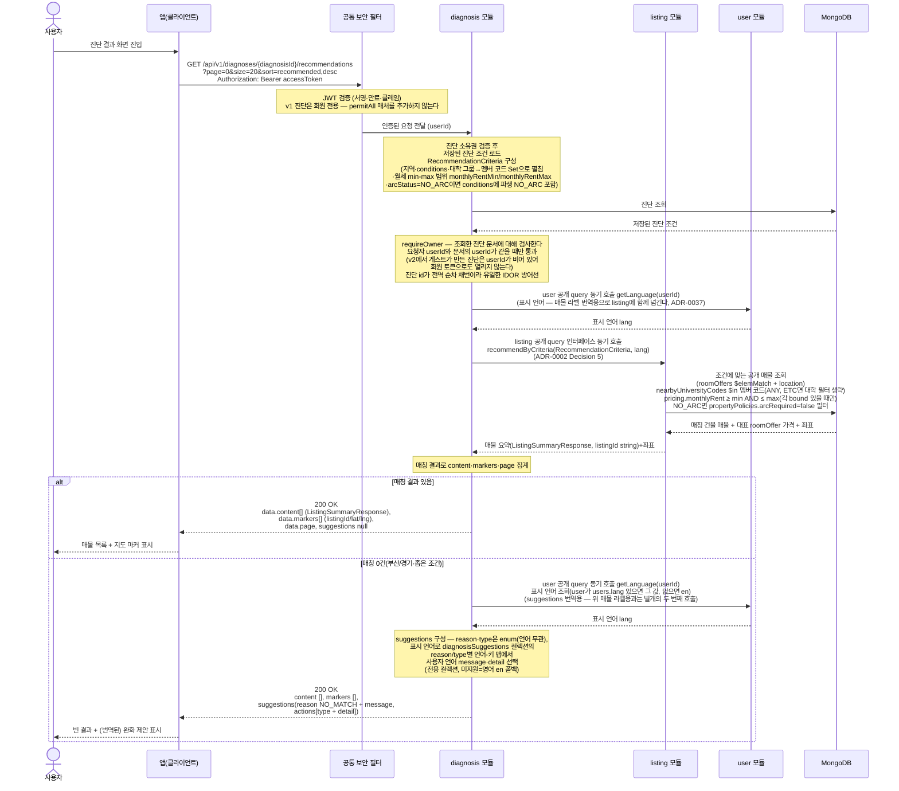

# US-2-2 — 진단 결과(추천 매물 + 지도 좌표) 조회

> 모듈: 맞춤 진단 & 매물 추천 · [유저 스토리](../../../requirements/user-stories.md) · [API 스펙](../../../api/specs/02-diagnosis-recommendation.md)

## 흐름 요약

- `GET /api/v1/diagnoses/{diagnosisId}/recommendations`로 본인 진단 조건에 맞는 매물과 지도 좌표를 조회한다(공통 보안 필터(SEC)가 컨트롤러 앞단에서 JWT를 검증한 뒤 diagnosis 모듈로 전달하고, diagnosis 모듈이 소유권을 확인, 기본 정렬 `recommended,desc`).
- diagnosis 모듈이 MongoDB에서 진단 조건을 조회한 뒤 `RecommendationCriteria`(지역·`conditions`·대학 그룹·월세 min-max 범위) 값객체를 만들어 listing 모듈의 **공개 query 인터페이스를 동기 호출**한다(`recommendByCriteria` 류, ADR-0002 Decision 5 — 모듈 간 동기 query 협력). 이때 선택된 `UniversityGroup`은 diagnosis가 멤버 대학 코드 집합으로 펼쳐 전달하며(`RecommendationCriteria.university`는 단일 `String`이 아니라 멤버 코드 `Set<String>` — `ETC`는 빈 집합), 월세는 `monthlyRentMin`/`monthlyRentMax`(nullable, null/부재=해당 bound 무제한)로 전달한다(결정: [ADR-0028](../../../adr/0028-diagnosis-questions-catalog-store.md)). ④ 주거 조건은 listing `ConditionTag` 이름과 통일하며, ⑥ `arcStatus`가 `NO_ARC`(미발급)이면 diagnosis가 동명의 파생 조건 `NO_ARC`(`DiagnosisCondition`)를 `conditions`에 더해 전달하고 listing은 이를 `propertyPolicies.arcRequired=false`(ARC 불요 매물만)로 해석한다(`ARC_ISSUED`이면 추가 없음). listing 모듈은 MongoDB에서 공개 건물 매물 중 조건·재고를 만족하는 `roomOffers[]`를 `$elemMatch`로 조회하되 `nearbyUniversityCodes`를 멤버 코드 `$in`(ANY 매칭, `ETC`(빈 집합)면 대학 필터 생략)으로, `pricing.monthlyRent`를 각 bound가 있을 때 `≥ min` AND `≤ max`의 별도 조건으로 적용해 매물 요약(`ListingSummaryResponse`, `listingId`는 ObjectId 문자열)과 좌표를 반환하고 diagnosis 모듈이 결과를 집계한다.
- 결과가 있으면 `200 OK` + `content[]`(매물 요약 `ListingSummaryResponse`)·`markers[]`(listingId/lat/lng)·`page` 메타를, 0건이면 빈 목록 + `suggestions`(조정 제안)를 동일하게 `200 OK`로 반환한다. `suggestions`의 `reason`/`type`은 언어 무관 enum이고, 사람이 보는 `message`/`detail`은 `user` 공개 query(`getLanguage`)로 취득한 표시 언어(`user`가 `users.lang`이 있으면 그 값, 없으면 `en`)로 **서버가 제공**한다 — **MongoDB `diagnosisSuggestions` 컬렉션**의 `reason`/`type`별 인라인 언어-키 맵에서 사용자 언어 값을 골라 채우며, 해당 언어 키가 없으면 영어(`en`)로 폴백한다(US-2-6 일관). messageKey 평탄 컬렉션(`diagnosisMessages`) 방식은 쓰지 않는다(인라인 언어-키 맵 전용 컬렉션).
- 타인 진단은 `403 FORBIDDEN`, 없는 진단은 `404 DIAGNOSIS_NOT_FOUND`로 처리된다.
- **이 v1 추천 엔드포인트는 회원 전용이다**(#181): 신규 `permitAll` 매처의 대상은 `/api/v2/diagnoses/**` 하나이므로 `/api/v1/diagnoses/**`는 계속 인증 필수이고(토큰 없으면 `401 UNAUTHENTICATED`), 위 다이어그램에 게스트 분기가 없다. **비회원의 추천 조회는 v2 전용 엔드포인트** `GET /api/v2/diagnoses/{diagnosisId}/recommendations`가 담당한다([us-2-7](us-2-7-v2-server-driven-flow.md)) — 검증·소유권·조건 매핑·listing 호출은 v1·v2가 공유하는 `DiagnosisRecommendationReader` 한 곳이라, 게스트 분기(신원 종류별 소유권 판정·`getLanguage` 미호출)는 **그 공유 컴포넌트 안에서** 들어가고 v1은 회원 요청만 그 코드를 탄다.
- 이 경로에는 `getLanguage` 호출이 **두 군데**다 — 공유 `DiagnosisRecommendationReader`가 매물 라벨 번역용 표시 언어를 `recommendByCriteria(criteria, language)`에 넘기느라 **매칭 유무와 무관하게 매 요청** 부르고([ADR-0037](../../../adr/0037-listing-localization-and-code-catalog.md)), v1은 0건일 때 `suggestions` 번역용으로 한 번 더 부른다(둘 다 회원 요청이라 `users.lang` 기준이다).
- 소유권 검사(`requireOwner`)는 **신원 종류가 같고 값이 같을 때만** 통과하도록 확장되므로, v2에서 게스트가 만든 진단(`userId` 비어 있음)은 이 v1 경로에 회원 토큰으로 와도 `403`이다 — 진단 id가 전역 순차 채번이라 이 검사가 유일한 IDOR 방어선이다. `listing` 모듈은 `recommendByCriteria`가 애초에 신원(userId)을 받지 않아 **코드 변경이 0건**이다(표시 언어는 신원이 아니라 문자열로 넘어간다).
