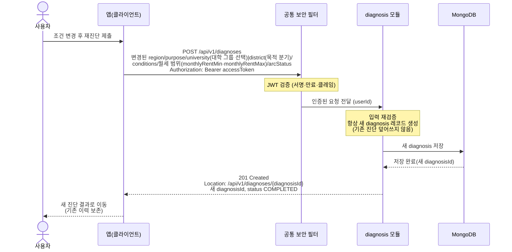

# US-2-4 — 재진단(새 진단 생성)

> 모듈: 맞춤 진단 & 매물 추천 · [유저 스토리](../../../requirements/user-stories.md) · [API 스펙](../../../api/specs/02-diagnosis-recommendation.md)

## 흐름 요약

- 재진단도 US-2-1과 동일한 `POST /api/v1/diagnoses`이며, 공통 보안 필터(SEC)가 컨트롤러 앞단에서 JWT를 검증한 뒤 diagnosis 모듈로 전달하고 diagnosis 모듈이 항상 새 diagnosis를 MongoDB에 저장해 새 `diagnosisId`를 발급하며 기존 진단을 덮어쓰지 않고 이력을 보존한다(`201 Created`).
- 재진단 본문도 US-2-1과 동일한 입력 검증 규칙을 적용한다(위반 시 `400 INVALID_INPUT` + `errors[]`).
- **이 재진단 경로는 회원 전용이다**(#181): US-2-1과 동일한 v1 엔드포인트라 게이트도 같다 — `/api/v1/diagnoses/**`에는 `permitAll` 매처를 추가하지 않으므로 토큰이 필수이고, 위 다이어그램에 게스트 분기가 없다. 게스트의 "재진단"은 이 엔드포인트가 아니라 **`POST /api/v2/diagnoses/start`를 다시 호출**하는 것이며, 그때 서버가 **새 게스트 세션 키를 발급**한다([us-2-7](us-2-7-v2-server-driven-flow.md)). 다만 **이전 키의 세션 문서가 서버에서 지워지는 것은 아니다** — 회원 세션은 `userId` 키 upsert(`upsertByUserId`)로 교체되지만 게스트는 키가 매번 달라 교체 대상이 없고, 앞선 세션은 남아 누적된다(그래서 게스트 세션·진단 문서의 TTL **도입 여부와 수치가 결정 필요**다 — 현재 저장소에는 TTL 인덱스가 하나도 없어 회원 진단도 영구 보존된다). 세션이 실제로 삭제되는 것은 `RESTART`·`TERMINATED`·확정으로 흐름이 끝날 때뿐이다([us-2-7](us-2-7-v2-server-driven-flow.md)).
