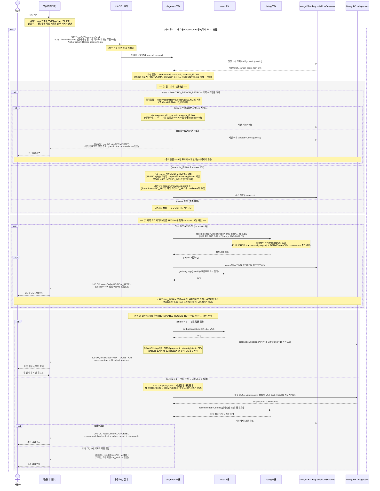

# US-2-7 (v2) — 서버 주도 진단 흐름 + 지역 매물 부재 시 재질의·종료

> 모듈: 맞춤 진단 & 매물 추천 · [유저 스토리](../../../requirements/user-stories.md) · [API 스펙](../../../api/specs/02-diagnosis-recommendation.md) · 결정: [ADR-0036](../../../adr/0036-diagnosis-v2-server-driven-flow.md)
>
> **범위**: 기존 v1(`/api/v1/diagnoses/*`, 클라이언트가 `step`을 지정하는 흐름)은 그대로 두고, **서버 주도 대화형 흐름을 `/api/v2`로 신설**한다(issue #157). 클라이언트는 `step`을 모르고 **`POST /api/v2/diagnoses/next`** 하나만 호출하며, 서버가 진행 위치(`cursor`)로 다음 질문을 결정한다. ① 지역 답 직후 매칭 매물이 0건이면 서버가 **"다른 지역 방을 찾아보시겠어요?"** 예외질문을 삽입하고, **"예" → 지역부터 재시작 / "아니오" → 진단 종료(`TERMINATED`)**. 6단계가 다 채워지면 서버가 **자동 확정**해 추천을 계산하고, 매칭 0건이면 `NO_MATCH` 코드만 반환한다(v2는 조정 제안 `suggestions`를 쓰지 않는다).

## 흐름 요약

- v2 진단은 앱이 `step`을 지정하지 않는 **서버 주도 대화형 흐름**이다. 클라이언트는 **`POST /api/v2/diagnoses/next`** 하나만 반복 호출하고, 본문에는 **현재 문항의 답 1개**(`AnswerRequest`, 최초·재개 호출은 무답 허용)만 담는다. 서버가 진행 위치·다음 질문·확정 시점을 모두 판단한다. 공통 보안 필터(SEC)가 컨트롤러 앞단에서 JWT를 검증한 뒤 diagnosis 모듈로 전달한다. v1(`/api/v1/diagnoses/*`)은 이 흐름과 무관하게 그대로 유지된다([ADR-0036](../../../adr/0036-diagnosis-v2-server-driven-flow.md)).
- 진행 상태는 **v2 전용 세션**에 담는다 — `diagnosisFlowSessions` 컬렉션의 세션 `{ draft(누적 답), cursor(진행한 슬롯 수 0~6), state(IN_FLOW | AWAITING_REGION_RETRY) }`. v1의 진행 중 진단(`diagnoses` 컬렉션 IN_PROGRESS 초안)과 **같은 "Mongo + 리포지토리 포트로 요청 사이 상태 보존" 패턴**이지만, `cursor`·`state` 같은 절차 필드가 v1 `Diagnosis`에는 없고 v1의 "사용자당 IN_PROGRESS 1건" 제약과 충돌하므로 **별도 컬렉션**으로 분리한다. 완료 시에만 `draft.complete()`로 정본 진단을 만들어 **기존 `diagnoses` 컬렉션에 저장**(v1 이력·상세·추천 읽기 경로 재사용)하고 세션은 삭제한다.
- **정본 순서는 `cursor`가 강제한다** — `REGION(1) → PURPOSE(2) → BRANCH(3, 저장된 purpose로 university|district) → CONDITIONS(4) → MONTHLY_RENT(5) → ARC_STATUS(6)`. 완료 판정을 `validateComplete`(제출 재검증)만으로 하면 `conditions`(④)가 필수가 아니어서 ④를 건너뛸 수 있고, ⑥ `arcStatus` 답이 `conditions`를 교차 기록(파생 `NO_ARC`)해 "필드 null=미답" 추론이 불안정하다. 그래서 **선형 진행·완료의 단일 정본은 `cursor`**이며, `validateComplete`는 자동 확정 시 정합 백스톱으로만 쓴다. 조건부 분기는 ③(BRANCH) 하나뿐이고 저장된 `purpose`로 `university`/`district`를 서버가 택일한다(카탈로그 분기 메타 없음 — US-2-5·[ADR-0028](../../../adr/0028-diagnosis-questions-catalog-store.md)).
- 매 `next` 호출은 서버가 (①답 디스패치 → ②지역 조기 게이트 → ③다음 질문/자동 확정)을 거쳐 **정확히 하나의 `resultCode`**로 응답한다(정상 `200 OK`, 공통 래퍼 `{ success, data, error }`의 `data`에 태그드 유니온):
  - **`NEXT_QUESTION`** — `cursor < 6`. 현재 슬롯 문항 1개를 `question`으로 반환(③ BRANCH는 저장된 `purpose`로 결정, 표시 라벨은 사용자 언어로 번역·`en` 폴백).
  - **`REGION_RETRY`** — ① 지역(REGION)을 방금 답했고 지역 조기 게이트에서 매칭 0건. 서버 합성 yes/no 질문("다른 지역 방을 찾아보시겠어요?")을 `question`으로 반환하고 `state=AWAITING_REGION_RETRY`로 전이.
  - **`TERMINATED`** — `AWAITING_REGION_RETRY`에서 `code=NO`. 세션을 삭제하고 진단종료코드를 반환(챗봇 종료). `question`·`recommendation` 없음.
  - **`COMPLETED`** — `cursor == 6`으로 자동 확정 후 매칭 매물이 있음. `recommendation { content, markers, page }` + `diagnosisId` 반환.
  - **`NO_MATCH`** — `cursor == 6` 자동 확정 후 매칭 0건. **코드만** 반환한다(v2는 조정 제안 `suggestions`를 쓰지 않는다 — v1의 `suggestions` 기능·시드는 그대로 두되 v2는 참조하지 않음).
- **① 답 디스패치(상태별)**: `state=AWAITING_REGION_RETRY`이면 `field=regionRetry` & `code∈{YES,NO}`만 허용(그 외 `400 INVALID_INPUT`) — `YES`면 `draft.region=null`·`cursor=0`·`state=IN_FLOW`로 리셋해 지역부터 재시작, `NO`면 세션 삭제 후 `TERMINATED`. `state=IN_FLOW`이고 답이 있으면 현재 `cursor` 슬롯의 기대 `field`와 일치하는지 검증(불일치 `400 INVALID_INPUT`, 순서 강제)한 뒤 공유 `applyAnswer`로 `draft`를 갱신하고 `cursor++`한다(⑥ `arcStatus=NO_ARC`면 파생 조건 `NO_ARC`를 `conditions`에 주입). 최초·재개(무답) 호출은 디스패치를 건너뛰고 곧장 다음 질문을 낸다.
- **② 지역 조기 게이트**는 방금 REGION을 답해 `cursor`가 `0→1`이 된 순간에만 돈다 — `region`만 채운 경량 조건(`RecommendationCriteria`, `size=1`)으로 `listing`의 공개 query(`recommendByCriteria`)를 **동기 호출**(즉시 결과 필요 → 이벤트 아님, [ADR-0002](../../../adr/0002-inter-module-communication-via-events.md) Decision 5)한다. `listing`은 자기 MongoDB만 조회하고(PUBLISHED + `address.city`(region) + ACTIVE `roomOffer`, cross-store 조인 없음 — [ADR-0005](../../../adr/0005-polyglot-persistence.md)) 매칭 존재 여부만 돌려준다. 0건이면 `REGION_RETRY`로 응답하고, 있으면 그대로 ③으로 진행한다. region-only는 이후 예산·조건·대학 필터 결과의 상위집합이라(0건이면 어떤 후속 조건으로도 0건) 지역 단계 조기 차단이 논리적으로 타당하다.
- **③ 자동 확정**은 `cursor == 6`(6슬롯 전부 응답)일 때 서버가 `draft.complete(now)`로 정본 진단을 확정(`IN_PROGRESS → COMPLETED`)하고 `diagnoses`에 저장한 뒤 전체 조건으로 `recommendByCriteria`를 호출한다 — 매칭이 있으면 `COMPLETED`(+추천), 없으면 `NO_MATCH`. 어느 쪽이든 세션을 삭제한다. 확정은 v1처럼 클라이언트가 별도로 요청하지 않고 **서버가 빌더 완성 시점에 판단**한다.
- **재시작·종료 의미**: `REGION_RETRY`의 "예"는 진행 세션을 새로 만들지 않고 기존 세션의 `region`만 비워 `cursor=0`으로 되돌린다(지역 예외질문은 REGION 직후에만 뜨므로 이후 슬롯은 아직 미수집 — 고아 세션 없음). "아니오"는 세션 자체를 폐기(`TERMINATED`)한다. 같은 0건 지역을 다시 고르면 게이트가 매 REGION 응답마다 재확인해 프롬프트가 다시 뜬다(서버 무한 루프 아님 — 사용자 주도).
- **번역(US-2-6 일관)**: `NEXT_QUESTION`·`REGION_RETRY`의 표시 문자열(`question`·`label`)만 사용자 표시 언어로 조립하고, `code`는 언어 무관 UPPER_SNAKE 불변이다. 표시 언어는 `user` 공개 query(`getLanguage`)를 동기 호출해 취득하며 미지원 언어는 영어로 폴백한다(US-2-5·US-2-6과 동일 i18n 경로).
- **멱등·견고성**: 터미널(`COMPLETED`/`NO_MATCH`/`TERMINATED`) 응답 후에는 세션이 삭제된 상태다 — 이때 재-POST가 오면(더블탭·재시도) 스테일 `answer`는 무시하고 REGION부터 **새 흐름**을 시작한다(중복 확정 방지). `AWAITING_REGION_RETRY` 상태에서 `regionRetry`가 아닌 `field`나 `YES`/`NO` 외 `code`는 `400 INVALID_INPUT`으로 거부한다.
- **에러 경계**: `resultCode`는 정상 흐름 신호이며 에러가 아니다 — `TERMINATED`·`NO_MATCH`도 `200 OK`다. 토큰 무효/만료/누락은 SEC가 `401`(`UNAUTHENTICATED`/`TOKEN_EXPIRED`), 입력 위반(잘못된 단계 답·`regionRetry` 규칙 위반·자동 확정 재검증 실패)은 `400 INVALID_INPUT` + `errors[]`로 공통 처리한다(진단 도메인 별도 코드 없음).
