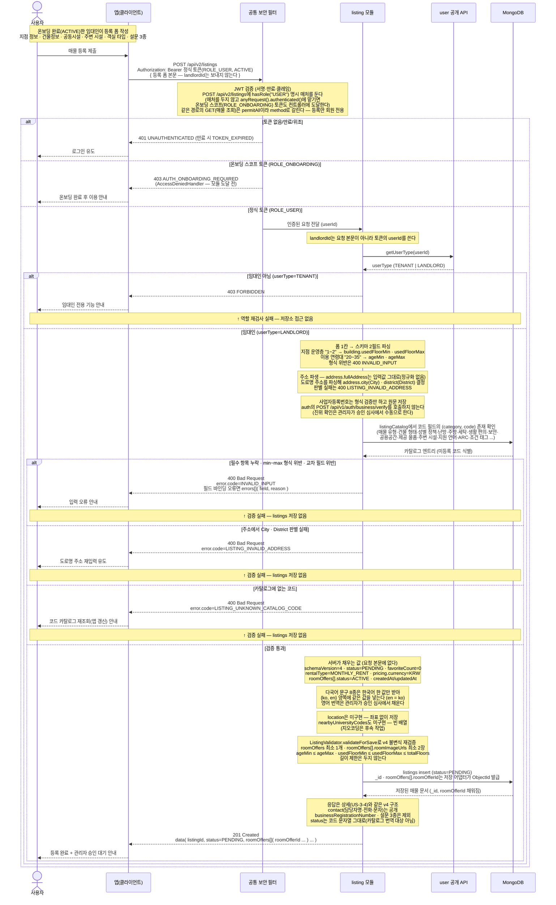

# US-3-6 — 임대인 매물 등록(POST /api/v2/listings)

> 모듈: 매물 등록 · 탐색 · 찜 · [유저 스토리](../../../requirements/user-stories.md) · [API 스펙](../../../api/specs/03-listings-favorites.md)
>
> 온보딩을 마친 임대인(`ROLE_USER`, `ACTIVE`, `userType=LANDLORD`)이 등록 폼으로 매물을 만드는 흐름이다. **매물 도메인의 첫 `/api/v2` 엔드포인트**였고, 이어서 조회 계열 6종도 `/api/v2`로 이관돼 같은 네임스페이스가 **GET은 공개 조회, POST는 임대인 등록**으로 갈린다([ADR-0040](../../../adr/0040-listing-query-api-v2-and-v1-sunset.md) — `/api/v1` 조회는 빈 결과·`404`만 내는 `deprecated` 스텁이다). 저장 스키마는 등록 폼 기준 v4([ADR-0039](../../../adr/0039-listing-schema-v4-registration-form.md))이고, 등록된 매물은 `status=PENDING`으로 저장돼 **관리자 승인 전까지 탐색·상세에 노출되지 않는다**(US-3-1·US-3-4는 `PUBLISHED`만 조회한다).

## 흐름 요약

- 임대인이 `POST /api/v2/listings`로 등록 폼 한 벌을 보내면 `listing` 모듈이 v4 매물 문서 1건을 만들어 `201 Created` + 생성된 매물(상세 응답 구조)을 반환한다. **매물 도메인의 첫 `/api/v2` 엔드포인트**였으며, 조회 계열 6종이 뒤이어 `/api/v2`로 이관돼 등록과 조회가 한 네임스페이스에 모였다([ADR-0040](../../../adr/0040-listing-query-api-v2-and-v1-sunset.md)).
- **인가는 두 겹이다.** SecurityConfig에 `POST /api/v2/listings` **명시 매처(`hasRole("USER")`)** 를 둔다 — 매처 없이 `anyRequest().authenticated()`에 맡기면 온보딩 스코프(`ROLE_ONBOARDING`) 토큰도 컨트롤러까지 도달한다(v2 진단과 달리 `permitAll`이 아니다). 스코프 부족 403은 SEC의 `AccessDeniedHandler` 책임이라 모듈에 닿지 않는다([ADR-0010](../../../adr/0010-jwt-authentication-filter.md)). 그 뒤 **서비스가 `user` 공개 query `getUserType(userId)`로 임대인 여부를 재검사**해 `userType=TENANT`면 `403 FORBIDDEN`으로 거절한다(모듈 간 동기 질의 — [ADR-0002](../../../adr/0002-inter-module-communication-via-events.md) Decision 5). `landlordId`는 요청 본문이 아니라 **토큰의 `userId`** 에서 가져오므로 남의 이름으로 등록할 수 없다.
- **다국어 문구는 한국어 한 값만 받는다.** 서버가 `{ko, en}` 양쪽에 같은 값을 넣는다(`en = ko`). 대상 8종 — `title`·`address.fullAddress`·`address.detail`·`nearestTransit.name`·`description`·`extraNotes`·`refundPolicy`·`roomOffers[].name`. 저장 계약(`LocalizedText`)이 두 언어를 모두 요구하므로 영어가 빈 문서는 만들 수 없고, 실제 번역은 관리자가 승인 심사에서 채운다. 등록 직후는 `PENDING`이라 세입자 조회에 노출되지 않는다.
- **서버가 채우는 값은 요청 본문에 없다**: `_id`·`roomOffers[].roomOfferId`(저장 어댑터가 ObjectId 발급)·`schemaVersion`(4)·`status`(`PENDING`)·`favoriteCount`(0)·`createdAt`/`updatedAt`·`rentalType`(`MONTHLY_RENT` 고정)·`pricing.currency`(`KRW` 고정)·`roomOffers[].status`(`ACTIVE`). 등록 직후 상태가 `PENDING`이므로 목록·지도·상세(`PUBLISHED`만 조회)에는 아직 나오지 않는다.
- **폼 1칸이 스키마 2필드로 갈라지는 입력은 서버가 파싱한다** — 지점 운영층 `1~2` → `building.usedFloorMin`·`usedFloorMax`, 이용 연령대 `20~35` → `ageMin`·`ageMax`. 형식이 어긋나면 `400 INVALID_INPUT`이고, `min ≤ max`와 `usedFloorMax ≤ totalFloors`는 `ListingValidator.validateForSave`가 저장 직전에 다시 확인한다.
- **주소는 입력값을 정규화하지 않는다** — `address.fullAddress`는 받은 그대로 저장하고, 도로명 주소를 파싱해 `address.city`(`City`)·`district`(`District`) enum만 파생한다. 판별할 수 없는 주소는 `400 LISTING_INVALID_ADDRESS`이며 이는 **좌표와 무관한 실패**다. **`location`(좌표)과 `nearbyUniversityCodes`는 이번 범위에서 미구현**이라 좌표 없이·빈 배열로 저장한다([ADR-0039](../../../adr/0039-listing-schema-v4-registration-form.md) 후속 작업).
- **코드 필드는 `listingCatalog` 대조로 검증한다** — 요청의 각 코드가 `(category, code)`로 카탈로그에 존재해야 하며, 없는 코드는 `400 LISTING_UNKNOWN_CATALOG_CODE`다(사용자 오타가 아니라 앱 코드표와 서버 카탈로그의 불일치라 `INVALID_INPUT`과 분리한다 — [error-response-guide](../../../api/error-response-guide.md); 카탈로그 19개 카테고리는 [ADR-0037](../../../adr/0037-listing-localization-and-code-catalog.md)·[ADR-0039](../../../adr/0039-listing-schema-v4-registration-form.md)). 구조 검증은 `roomOffers` 최소 1개·`roomOffers[].roomImageUrls` 최소 2장이며, **문자열 길이 제한은 두지 않는다**(정의서에서 길이 컬럼을 삭제한 결정과 일관). 검증 실패 분기에는 `listings` 저장이 없다.
- **사업자등록번호는 등록 시점에 자동 검증하지 않는다** — 형식만 확인하고 원문을 매물 문서에 저장한다([ADR-0039](../../../adr/0039-listing-schema-v4-registration-form.md) §3). `auth`의 무상태 검증 `POST /api/v1/auth/business/verify`([US-1-8](../01-auth-onboarding/us-1-8-business-verification.md))를 **호출하지 않으며**, 진위 확인은 관리자가 승인 심사에서 수동으로 한다(엔드포인트 자체는 그대로 둔다).
- **응답 노출 범위는 상세 조회(US-3-4)와 같다** — 매물별 담당 연락처 `contact`(담당자명·전화·문자)는 임대인 개인 연락처와 별개 값이라 **세입자에게 공개**하고, `businessRegistrationNumber`와 설문 3종(`preferredNationalities`·`contractDifficulties`·`serviceFeedback`)은 응답에서 제외한다. `status`는 카탈로그 번역 대상이 아니므로 **코드 문자열 그대로** 내려간다.
- **후속(이번 범위 아님)**: 관리자 승인(`PENDING → PUBLISHED`/`REJECTED`, 승인 조건에 `location` 보유 포함)·임대인 매물 수정·지오코딩으로 `location`·`nearbyUniversityCodes` 채우기·재고 관리.
