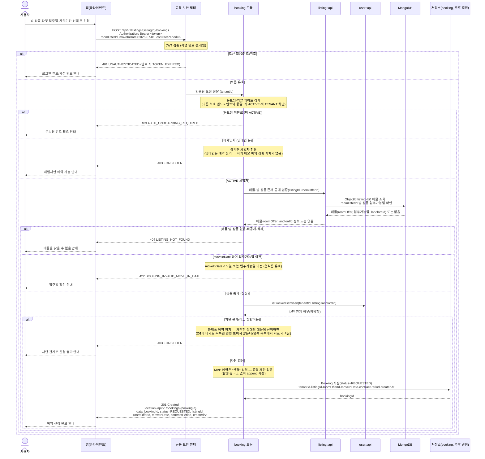

# US-4-1 — 매물 예약 생성(신청 저장)

> 모듈: 매물 예약(신청) · [유저 스토리](../../../requirements/user-stories.md) · [API 스펙](../../../api/specs/04-booking-inquiry-chat.md)

## 흐름 요약

- 보호 엔드포인트이므로 **공통 보안 필터(SEC)** 가 컨트롤러 앞단에서 `Authorization: Bearer <token>`의 JWT(서명·만료·클레임)를 검증한 뒤 인증된 요청(tenantId)을 **booking 모듈**로 전달한다. 토큰이 없거나 만료/위조면 필터가 `401 UNAUTHENTICATED`(만료 시 `TOKEN_EXPIRED`)로 막는다. 이후 booking 모듈이 요청자가 `ACTIVE`인지 다른 보호 엔드포인트와 **동일한 온보딩 상태 게이트**로 검사하고, 비`ACTIVE`(온보딩 미완료) 세입자는 `403 AUTH_ONBOARDING_REQUIRED`로 차단한다(코드 게이트와 1:1 일치).
- `ACTIVE` 세입자(`userType=TENANT`)가 `POST /api/v1/listings/{listingId}/bookings`로 `roomOfferId`·`moveInDate`·`contractPeriod`(개월수)를 보내면 **booking 모듈**이 **`listing::api`** 로 매물·방 상품 존재·공개를 동기 조회(`->>`)해 검증한다(차단 가드 판정에 쓸 소유자 `landlordId`도 함께 받는다). `listingId`·`roomOfferId`는 MongoDB ObjectId 문자열이며, 매물·`roomOffer` 조회는 listing 모듈이 MongoDB에서, 예약 저장은 booking 모듈이 자기 저장소에서 각자 자기 데이터를 읽고 쓴다(cross-store 조인 금지, [ADR-0005](../../../adr/0005-polyglot-persistence.md)).
- 매물·방 상품 검증을 통과하면 **예약을 저장하기 전에 차단 가드(양방향)** 가 선다 — booking 모듈이 **`user::api`** 의 `isBlockedBetween(tenantId, listing.landlordId)`로 요청자와 매물 소유자 사이의 차단 관계를 **어느 방향이든** 판정하고, 참이면 `403 FORBIDDEN`으로 막는다. 차단은 예약 단위가 아니라 **사용자 단위 전역**이며, 이는 예약이 "신청" 성격이라 **중복 신청이 허용되기 때문**이다(`V9__bookings.sql`) — 예약 단위 차단이라면 차단된 상대가 같은 방 상품에 새 신청을 얼마든지 다시 넣을 수 있다. 가드가 없으면 **블랙홀 예약**이 생긴다: 차단한 상대의 매물에 신청하면 `201`이 나가도 그 예약은 양쪽 목록에서 서로 가려져 **영영 보이지 않는다**.
- 가드까지 통과 시 booking 모듈이 `Booking`을 `REQUESTED` 상태로 **저장소**에 생성하고 `201 Created` + `Location: /api/v1/bookings/{bookingId}`와 `bookingId`·`status=REQUESTED`·`listingId`·`roomOfferId`·`moveInDate`·`contractPeriod`·`createdAt`를 반환한다. **MVP의 예약은 "신청" 성격이라 중복 제한이 없다** — 활성 유니크 제약 없이 append 저장하며, 같은 방 상품에도 여러 신청이 가능하다(`BOOKING_ALREADY_EXISTS` 없음).
- 인증 실패는 `401`, 비세입자(임대인)는 `403 FORBIDDEN`, 매물/방 상품 부재·비공개·삭제는 `404 LISTING_NOT_FOUND`, 과거·입주가능일 이전 입주일은 `422 BOOKING_INVALID_MOVE_IN_DATE`, **요청자와 매물 소유자 사이의 차단 관계(양방향)는 `403 FORBIDDEN`** 으로 차단된다. 이들 권한·비즈니스 규칙 판단은 필터가 아니라 booking 모듈의 몫이며, 차단된 경로에서는 저장소에 도메인 상태를 쓰지 않는다.
- **예약 카드(`BOOKING_CARD`) 자동 전송·채팅방 보장·`BookingCreatedEvent` 발행·푸시 알림은 후속(문의·인앱 채팅)으로 이연**한다 — 본 스토리(1차 MVP)에서는 예약 저장만 수행한다.

> 신설 의존: 차단 가드가 `user::api`의 `isBlockedBetween(a, b)`(공개 쿼리, 양방향 판정)를 새로 호출한다. **`booking → user :: api`는 이미 화이트리스트**라 새 모듈 의존 엣지가 생기지 않는다 — 기존 허용 의존 위에 호출 하나가 얹힐 뿐이다(`user_blocks`는 `user` 소유이며 booking은 저장소를 직접 읽지 않는다, [ADR-0005](../../../adr/0005-polyglot-persistence.md)).

> 저장소: `booking`은 **MySQL로 이미 배포된 사실**이다(`V9__bookings.sql`·`V11__add_bookings_landlord_id.sql`) — 트랜잭션·유니크 제약·숫자 PK 요구와도 맞는다. 다만 [ADR-0005](../../../adr/0005-polyglot-persistence.md) 폴리글랏 배치 표에 이 배치를 반영하는 일은 **아직 열려 있다**(본 문서가 그 ADR 결정을 대신하지 않는다).
