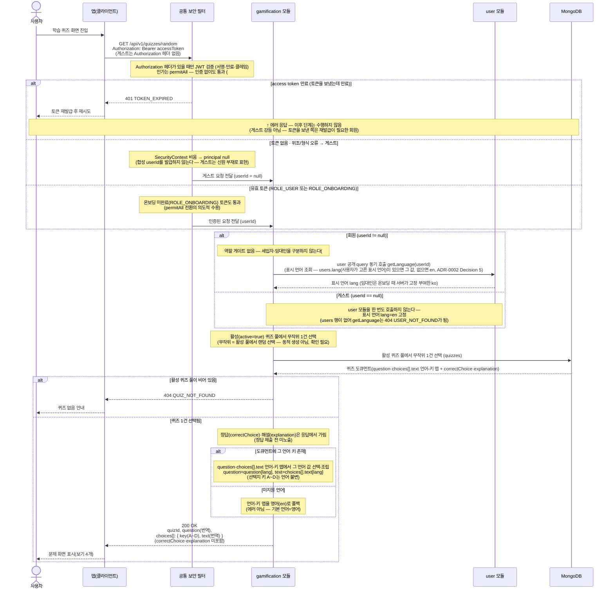

# US-6-1 — 랜덤 퀴즈 조회

> 모듈: 게이미피케이션 (퀴즈) · [유저 스토리](../../../requirements/user-stories.md) · [API 스펙](../../../api/specs/06-gamification.md)

## 흐름 요약

- `GET /api/v1/quizzes/random`으로 gamification 모듈이 **활성(`active=true`) 퀴즈 풀에서 무작위 1건**을 골라 사용자 표시 언어로 번역된 문제만 응답한다(공통 보안 필터(SEC)가 컨트롤러 앞단에서 JWT를 검증한 뒤 모듈로 전달). 요청마다 무작위 1건을 서빙하며 **무제한 반복·무상태**다 — 제출 기록·포인트·`quizDate`·오늘/일일 개념이 없다.
- 모듈은 MongoDB `quizzes` 카탈로그 컬렉션의 활성 풀에서 무작위 1건을 선택한다(진단 `diagnosisQuestions`와 동일한 문서 카탈로그 패턴). `active` 불리언이 랜덤 풀을 게이트한다. 활성 풀이 비어 있으면 `404 QUIZ_NOT_FOUND`로 응답한다.
- 응답은 `{ quizId, question(번역), choices[]{ key(A~D), text(번역) } }`이다. `question`·choices의 `text`는 `quizzes` 도큐먼트의 인라인 언어-키 맵(`{"en":..,"ja":..,"ko":..}`)에서 사용자 언어 값을 골라 채운 표시 문자열이고, 선택지 키 `A~D`는 **언어 불변**(채점은 키 기준)이다. **정답(`correctChoice`)·해설(`explanation`)은 이 조회 응답에 포함하지 않는다** — 정답 제출(US-6-2) 시점에만 노출된다.
- 표시 언어는 `user`가 보유하며 **`users.lang`(사용자가 고른 표시 언어)이 있으면 그 값, 없으면 `en`**으로 정한다([ADR-0029](../../../adr/0029-diagnosis-i18n-strategy.md) 개정(#141)). 회원 요청이면 gamification 모듈은 JWT 클레임에 의존하지 않고 **항상 `user`의 공개 query(`getLanguage`)를 동기 호출**해 표시 언어(`lang`)를 취득한다(즉시 결과가 필요한 조회 → ADR-0002 Decision 5). 해당 언어 키가 없으면 **영어(`en`)로 폴백**한다(에러 아님; 기본 언어=영어).
- (확인 필요) "무작위"는 활성 풀에서의 **랜덤 선택**을 뜻하며 동적 생성이 아니다.
- `/api/v1/quizzes/**`는 **`permitAll`** 로 열려 비회원(게스트)도 호출할 수 있다(#181 — 기존 `hasRole("USER")` 매처를 수정). 게스트 신원은 합성 userId가 아니라 **`userId == null`(신원 부재)** 로 표현한다. 토큰을 아예 보내지 않은 요청과 위조·형식 오류 토큰은 게스트로 처리하고, **토큰을 보냈는데 만료된 요청은 게스트로 강등하지 않고 `401 TOKEN_EXPIRED`** 를 유지한다(재발급이 필요한 회원이므로).
- **게스트 경로에는 신원 소비자가 하나도 남지 않는다** — 표시 언어를 정하는 `getLanguage`를 **호출하지 않고** `en`으로 고정한다. 이 호출은 `users` 행이 없으면 `404 USER_NOT_FOUND`를 던지므로 게스트에게는 "기본값"이 아니라 **호출 회피**가 요점이다. `quizzes` 도큐먼트에는 userId 필드가 없어(무상태 카탈로그 — [ADR-0035](../../../adr/0035-gamification-quiz-random-stateless-catalog.md)) 게스트 요청은 영속에도 흔적을 남기지 않는다.
- **이 엔드포인트에는 역할 게이트가 없다** — 세입자 전용 게이트(`assertTenant` → `getUserType`)를 제거했다(#181). `permitAll`로 비로그인 게스트가 볼 수 있게 된 마당에 로그인한 임대인만 `403`으로 막는 것은 앞뒤가 맞지 않고(임대인이 로그아웃하면 그대로 볼 수 있어) 실효도 없기 때문이다. 따라서 **로그인한 임대인도 `200 OK`** 다(종전 `403 FORBIDDEN`에서 변경) — `403 FORBIDDEN`(TenantOnly) 케이스는 이 도메인에서 완전히 사라진다.
- 또한 `hasRole("USER")`가 사라지면서 온보딩 미완료(PENDING/TERMS_AGREED, `ROLE_ONBOARDING`) 토큰도 통과하므로 `403 AUTH_ONBOARDING_REQUIRED`는 이 엔드포인트에서 더 이상 발생하지 않는다(의도적 수용 — 단 `userId != null`이므로 표시 언어는 `users.lang`을 따른다).
- 호출자별 결과는 다음과 같다.

| 호출자 | 결과 | 표시 언어 |
| --- | --- | --- |
| 비로그인 게스트 | 200 | `en` 고정(`getLanguage` 미호출) |
| 세입자(ACTIVE) | 200 | `users.lang` |
| 임대인 | 200 (종전 403에서 변경) | `users.lang` = `ko`(온보딩 시 서버 고정 부여, #141) |
| 온보딩 미완료(PENDING/TERMS_AGREED) | 200 | `users.lang` |
