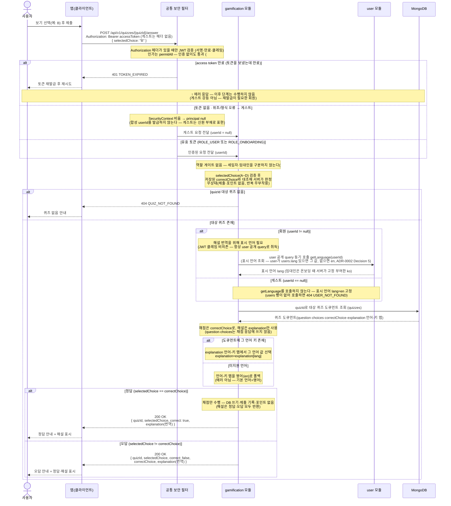

# US-6-2 — 퀴즈 정답 제출 및 즉시 피드백

> 모듈: 게이미피케이션 (퀴즈) · [유저 스토리](../../../requirements/user-stories.md) · [API 스펙](../../../api/specs/06-gamification.md)

## 흐름 요약

- `POST /api/v1/quizzes/{quizId}/answer`에 `selectedChoice`(A~D)를 보내면 gamification 모듈이 MongoDB `quizzes`에서 `quizId`로 퀴즈 도큐먼트를 읽어(랜덤 조회와 동일한 단건 도큐먼트 읽기) 저장된 `correctChoice`와 대조해 서버가 판정하고 `200 OK`로 즉시 피드백한다. 채점에는 `correctChoice`, 해설에는 `explanation`만 사용한다(`question`·`choices`는 채점 응답에 쓰지 않는다)(공통 보안 필터(SEC)가 컨트롤러 앞단에서 JWT를 검증한 뒤 모듈로 전달). **무상태 채점** — 제출 기록·포인트 적립·저장이 전혀 없고, 같은 요청을 반복해도 부작용이 없다(멱등·재생 가능). `201 Created`/`Location`이 아니다.
- 정답이면 `{ quizId, selectedChoice, correct: true, explanation(번역) }`을 응답한다. 오답이면 `{ quizId, selectedChoice, correct: false, correctChoice, explanation(번역) }`을 응답한다 — 해설(`explanation`)은 정답·오답 모두 사용자 표시 언어로 번역해 반환하고, `correctChoice`는 오답일 때만 포함한다.
- 해설 번역을 위해 회원 요청이면 gamification 모듈은 `user`의 공개 query(`getLanguage`)를 동기 호출해 표시 언어(`lang`)를 취득하고(ADR-0002 Decision 5), `quizzes` 도큐먼트의 `explanation` 언어-키 맵에서 그 언어 값을 고른다. 해당 언어 키가 없으면 **영어(`en`)로 폴백**한다(에러 아님). 선택지 키 `A~D`는 **언어 불변**이며 채점은 키 기준으로 한다.
- 오류 경계: `selectedChoice`가 A~D가 아니면 `400 INVALID_INPUT`, JSON 파싱 실패 등은 `400 MALFORMED_REQUEST`, `quizId`에 해당하는 퀴즈가 없으면 `404 QUIZ_NOT_FOUND`로 반환한다(하루 1회 제한·중복 제출 개념이 없으므로 `409`/`422`는 없다).
- `/api/v1/quizzes/**`는 **`permitAll`** 로 열려 비회원(게스트)도 채점을 요청할 수 있다(#181). 게스트 신원은 **`userId == null`(신원 부재)** 이며 합성 userId를 발급하지 않는다. 게스트 경로에서는 표시 언어 조회(`getLanguage`)를 **호출하지 않고**(호출하면 `users` 행이 없어 `404 USER_NOT_FOUND`) 해설을 `en`으로 내려준다. 채점은 무상태라 게스트여도 저장·기록이 없다.
- **이 엔드포인트에는 역할 게이트가 없다** — 세입자 전용 게이트(`assertTenant` → `getUserType`)를 제거했다(#181). `permitAll`로 게스트가 채점할 수 있는데 로그인한 임대인만 막는 것은 실효가 없기 때문이다(임대인이 로그아웃하면 그대로 호출된다). 따라서 **로그인한 임대인도 `200 OK`** 다(종전 `403 FORBIDDEN`에서 변경) — `403 FORBIDDEN`(TenantOnly)은 이 도메인에서 사라진다.
- 토큰 없음·위조는 게스트로 처리하지만 **만료된 access token은 `401 TOKEN_EXPIRED`** 를 유지한다(재발급이 필요한 회원이므로). 온보딩 미완료(`ROLE_ONBOARDING`) 토큰도 통과하므로 `403 AUTH_ONBOARDING_REQUIRED`는 이 엔드포인트에서 발생하지 않는다.
- 호출자별 결과는 다음과 같다(해설 `explanation`의 표시 언어).

| 호출자 | 결과 | 표시 언어 |
| --- | --- | --- |
| 비로그인 게스트 | 200 | `en` 고정(`getLanguage` 미호출) |
| 세입자(ACTIVE) | 200 | `users.lang` |
| 임대인 | 200 (종전 403에서 변경) | `users.lang` = `ko`(온보딩 시 서버 고정 부여, #141) |
| 온보딩 미완료(PENDING/TERMS_AGREED) | 200 | `users.lang` |
