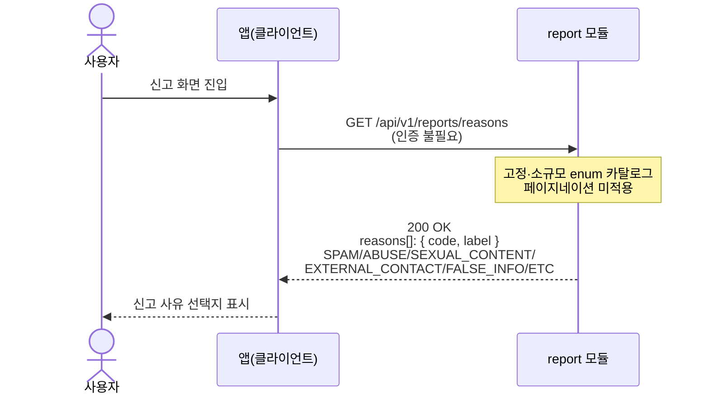

# US-7-3 — 신고 사유 목록(enum 메타) 조회

> 모듈: 신고 처리 · [유저 스토리](../../../requirements/user-stories.md) · [API 스펙](../../../api/specs/07-reports.md)

## 흐름 요약

- 앱은 신고 화면에서 인증 없이 `GET /api/v1/reports/reasons`를 `report 모듈`에 호출한다.
- `report 모듈`은 고정·소규모 enum 카탈로그를 페이지네이션 없이 `200 OK`로 한 번에 반환한다.
- 응답의 `reasons[]`(`code`/`label`)로 앱이 서버와 동일한 신고 사유 선택지를 구성한다.
