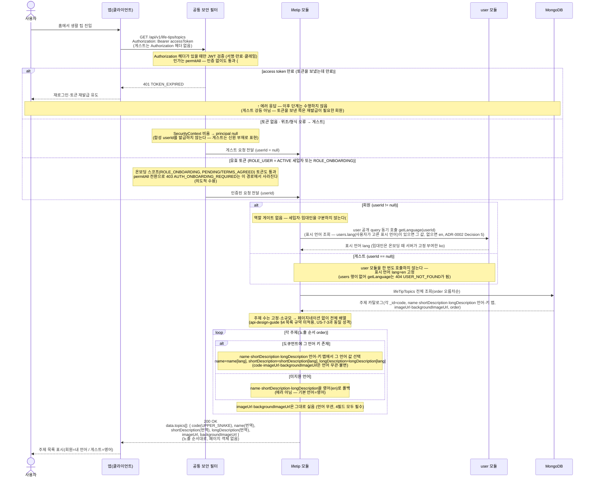

# US-8-1 — 생활 팁 주제 목록 조회 (표시 언어 기반 번역)

> 모듈: 생활 팁 (주제별 생활 정보) · [유저 스토리](../../../requirements/user-stories.md) · [API 스펙](../../../api/specs/08-life-tips.md)

## 흐름 요약

- 홈 진입점에서 `GET /api/v1/life-tips/topics`로 `lifetip 모듈`이 생활 팁 주제 전체를 노출 순서대로 반환한다. 공통 보안 필터(SEC)가 컨트롤러 앞단에서 JWT를 검증한 뒤 모듈로 전달한다.
- **이 엔드포인트는 `permitAll`이다** — `/api/v1/life-tips/**`의 기존 `hasRole("USER")` 매처를 수정해 비회원(게스트)에게 연다(#181). 게스트 신원은 합성 userId가 아니라 **`userId == null`(신원 부재)** 로 표현하고, 생활 팁은 영속에 userId 필드가 없어 **세션 키도 요구하지 않는다**. 토큰 미전송·위조/형식 오류는 게스트로 처리하지만, **토큰을 보냈는데 만료된 요청은 게스트로 강등하지 않고 `401 TOKEN_EXPIRED`** 를 유지한다(재발급이 필요한 회원이므로). `hasRole("USER")`가 사라지면서 온보딩 미완료(PENDING/TERMS_AGREED, `ROLE_ONBOARDING`) 토큰도 통과하므로 **`403 AUTH_ONBOARDING_REQUIRED`는 이 엔드포인트에서 더 이상 발생하지 않는다**(의도적 수용).
- **이 엔드포인트에는 역할 게이트가 없다** — 세입자 전용 게이트(`assertTenant` → `getUserType`)를 제거했다(#181). `permitAll`로 비로그인 게스트가 볼 수 있게 된 마당에 로그인한 임대인만 `403`으로 막는 것은 앞뒤가 맞지 않고(임대인이 로그아웃하면 그대로 볼 수 있어) 실효도 없기 때문이다. 따라서 **로그인한 임대인도 `200 OK`** 다(종전 `403 FORBIDDEN`에서 변경) — `403 FORBIDDEN`(TenantOnly) 케이스는 이 도메인에서 완전히 사라진다. 호출자별 결과는 다음과 같다.

| 호출자 | 결과 | 표시 언어 |
| --- | --- | --- |
| 비로그인 게스트 | 200 | `en` 고정(`getLanguage` 미호출) |
| 세입자(ACTIVE) | 200 | `users.lang` |
| 임대인 | 200 (종전 403에서 변경) | `users.lang` = `ko`(온보딩 시 서버 고정 부여, #141) |
| 온보딩 미완료(PENDING/TERMS_AGREED) | 200 | `users.lang` |

- 번역 언어 결정을 위한 표시 언어는 `user`가 보유하며 **`users.lang`(사용자가 고른 표시 언어)이 있으면 그 값, 없으면 `en`**으로 정한다([ADR-0029](../../../adr/0029-diagnosis-i18n-strategy.md) 개정(#141)). **회원 요청이면** `lifetip` 모듈은 JWT 클레임에 의존하지 않고 **항상 `user`의 공개 query(`getLanguage`)를 동기 호출**해 표시 언어(`lang`)를 취득한다(즉시 결과가 필요한 조회 → ADR-0002 Decision 5). 이를 위해 모듈 의존 `lifetip → user`를 추가한다(`Accept-Language` 헤더·토큰 클레임 미사용). 세입자 게이트를 제거한 뒤 이 `getLanguage`가 `lifetip → user`의 **유일한** 호출로 남는다. 임대인은 온보딩 완료 시 서버가 국적 `KR`·표시 언어 `ko`를 고정 부여하므로(#141, `User.completeLandlordOnboarding`) 주제 목록을 **한국어로** 본다.
- **게스트 경로에는 `user` 모듈 호출이 하나도 없다** — 표시 언어를 정하는 `getLanguage`를 **호출하지 않고** `en`으로 고정한다(세입자 게이트는 회원 경로에서도 이미 사라졌다). 이 호출은 `users` 행이 없으면 `404 USER_NOT_FOUND`를 던지므로(`en` 폴백은 행이 존재하고 `lang`이 null일 때만 동작) 게스트 분기의 요점은 기본값이 아니라 **호출 회피**다. 온보딩 미완료 토큰은 `userId != null`이라 게스트가 아니며 `users.lang`을 따른다.
- 모듈은 **MongoDB `lifeTipTopics` 컬렉션**에서 주제 전체를 `order` 오름차순으로 조회한다. 각 주제는 언어 무관 식별 `code`(`_id`, UPPER_SNAKE)와 노출 순서 `order`, 표시 텍스트 `name`·`shortDescription`·`longDescription`(각각 인라인 언어-키 맵), 언어 무관 불변 이미지 `imageUrl`·`backgroundImageUrl`(절대 CDN URL 문자열)을 갖는다. 서버가 사용자 언어 값(`name[lang]`·`shortDescription[lang]`·`longDescription[lang]`)으로 표시 텍스트를 채우고, 해당 언어 키가 없으면 **영어(`en`)로 폴백**한다(에러 아님). `imageUrl`·`backgroundImageUrl`은 언어 선택(`pickLabel`)을 타지 않고 그대로 싣는다(주제의 4필드는 모두 필수·NOT NULL이라 "이미지 없는 주제" 경계 케이스가 없다 — 사진 유무로 nullable인 `LifeTip.imageUrl`과 구분).
- 응답 `data.topics[]`는 `{ code, name, shortDescription, longDescription, imageUrl, backgroundImageUrl }`이며, 주제 수는 고정·소규모라 **페이지네이션 없이 전체 배열**을 한 번에 반환한다(api-design-guide §4 목록 규약 미적용, US-7-3과 동일 성격). `code`·`imageUrl`·`backgroundImageUrl`은 언어와 무관하게 동일(불변)하고 표시 텍스트(`name`·`shortDescription`·`longDescription`)만 언어별이다. `code`는 US-8-2에서 특정 주제의 팁을 지정하는 path 키로 쓰인다. 홈 화면 주제 카드는 `imageUrl`+`shortDescription`, 주제 상세 상단은 `backgroundImageUrl`+`longDescription`으로 그리며, 6필드가 이 한 응답에 함께 실려 앱이 목록에서 받은 주제 객체를 상세 화면까지 들고 간다.
