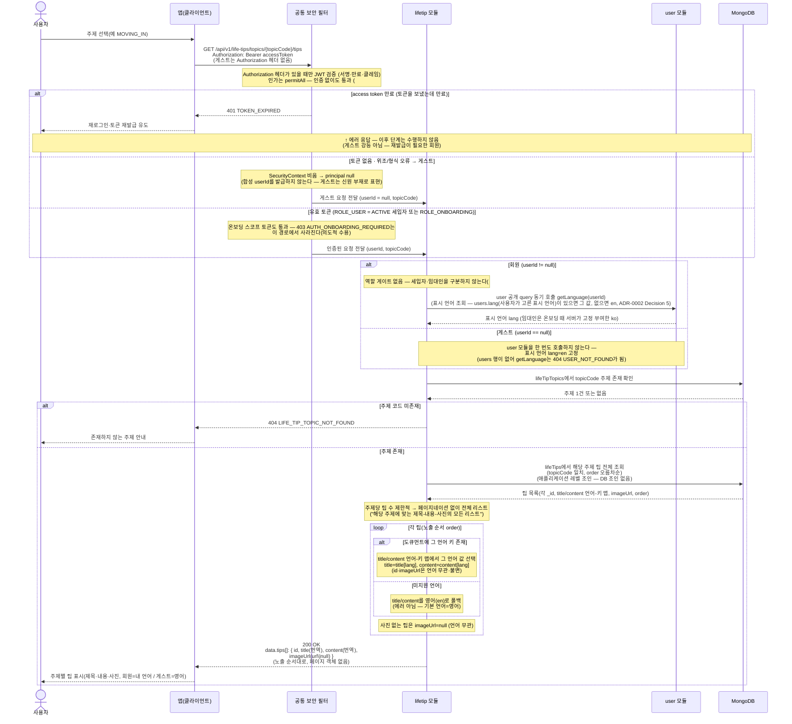

# US-8-2 · US-8-3 — 주제별 생활 팁(제목·내용·사진) 조회 + 표시 언어 기반 번역

> 모듈: 생활 팁 (주제별 생활 정보) · [유저 스토리](../../../requirements/user-stories.md) · [API 스펙](../../../api/specs/08-life-tips.md)

## 흐름 요약

- `GET /api/v1/life-tips/topics/{topicCode}/tips`로 `lifetip 모듈`이 선택한 주제(`topicCode`)에 속한 생활 팁 전체를 노출 순서(`order`)대로 반환한다. 공통 보안 필터(SEC)가 컨트롤러 앞단에서 JWT를 검증한 뒤 모듈로 전달한다. US-8-1과 동일한 게이트다.
- **US-8-1과 같이 `permitAll`이다** — `/api/v1/life-tips/**` 매처 하나가 두 엔드포인트를 함께 연다(#181). 게스트는 `userId == null`(신원 부재)이며 합성 userId도 세션 키도 발급하지 않는다(생활 팁 영속에 userId 필드가 없다). 토큰 미전송·위조는 게스트, **만료 토큰은 `401 TOKEN_EXPIRED` 유지**(재발급이 필요한 회원이므로), 온보딩 미완료(`ROLE_ONBOARDING`) 토큰은 통과하므로 `403 AUTH_ONBOARDING_REQUIRED`가 사라진다.
- **US-8-1과 같이 역할 게이트가 없다** — 세입자 전용 게이트(`assertTenant` → `getUserType`)를 제거했다(#181). 게스트에게 열린 마당에 로그인한 임대인만 막는 것은 실효가 없기 때문이다(임대인이 로그아웃하면 그대로 볼 수 있다). 따라서 **로그인한 임대인도 `200 OK`** 다(종전 `403 FORBIDDEN`에서 변경) — `403 FORBIDDEN`(TenantOnly)은 이 도메인에서 사라진다. 호출자별 결과는 다음과 같다.

| 호출자 | 결과 | 표시 언어 |
| --- | --- | --- |
| 비로그인 게스트 | 200 | `en` 고정(`getLanguage` 미호출) |
| 세입자(ACTIVE) | 200 | `users.lang` |
| 임대인 | 200 (종전 403에서 변경) | `users.lang` = `ko`(온보딩 시 서버 고정 부여, #141) |
| 온보딩 미완료(PENDING/TERMS_AGREED) | 200 | `users.lang` |

- 번역 언어 결정을 위한 표시 언어는 `user`가 보유하며, **회원 요청이면** `lifetip` 모듈은 JWT 클레임에 의존하지 않고 **항상 `user`의 공개 query(`getLanguage(userId)`)를 동기 호출**해 표시 언어(`lang`)를 취득한다(`user`가 **`users.lang`(사용자가 고른 표시 언어)이 있으면 그 값, 없으면 `en`**으로 정함 — ADR-0002 Decision 5 · [ADR-0029](../../../adr/0029-diagnosis-i18n-strategy.md) 개정(#141) · 모듈 의존 `lifetip → user` 추가 · `Accept-Language`·토큰 클레임 미사용). 세입자 게이트 제거 후 이 호출이 `lifetip → user`의 **유일한** 호출이다. 임대인은 온보딩 완료 시 서버가 `KR`·`ko`를 고정 부여하므로(`User.completeLandlordOnboarding`) 팁을 **한국어로** 본다.
- **게스트 요청은 `getLanguage`를 호출하지 않는다** — 표시 언어를 `en`으로 고정한다(역할 게이트는 회원 경로에서도 이미 없다). `users` 행이 없는 신원에 이 호출은 `404 USER_NOT_FOUND`가 되므로 요점은 기본값이 아니라 **호출 회피**다. 주제 존재 확인(`404 LIFE_TIP_TOPIC_NOT_FOUND`)과 팁 조회는 신원과 무관하므로 게스트도 회원과 동일한 경로를 탄다.
- 모듈은 먼저 **MongoDB `lifeTipTopics`** 에서 `topicCode` 주제의 존재를 확인한다 — 카탈로그에 없는 주제 `code`는 `404 LIFE_TIP_TOPIC_NOT_FOUND`(신규 도메인 에러코드, `*_NOT_FOUND` 규약 · `ErrorCode` 등록 필요)다.
- 주제가 존재하면 **MongoDB `lifeTips`** 에서 `topicCode`가 일치하는 팁 전체를 `{ topicCode: 1, order: 1 }` 복합 인덱스로 노출 순서대로 조회한다(주제 : 팁 = 1 : N · 애플리케이션 레벨 조인, cross-collection DB 조인 없음). 각 팁의 `title`·`content`는 인라인 언어-키 맵에서 사용자 언어 값(`title[lang]`/`content[lang]`)으로 채우고, 해당 언어 키가 없으면 **영어(`en`)로 폴백**한다(에러 아님). `imageUrl`(사진)은 언어 무관이며 사진이 없는 팁은 `null`(또는 생략)로 둔다.
- 응답 `data.tips[]`는 `{ id, title, content, imageUrl }`이며, 주제당 팁 수가 제한적이므로 **페이지네이션 없이 전체 리스트**를 한 번에 반환한다. `id`·`imageUrl`은 언어와 무관하게 동일(불변)하고 표시 텍스트(`title`·`content`)만 언어별이다(US-8-3 — 응답 스키마는 언어와 무관하게 동일, 서버가 언어 문자열만 채운다).
